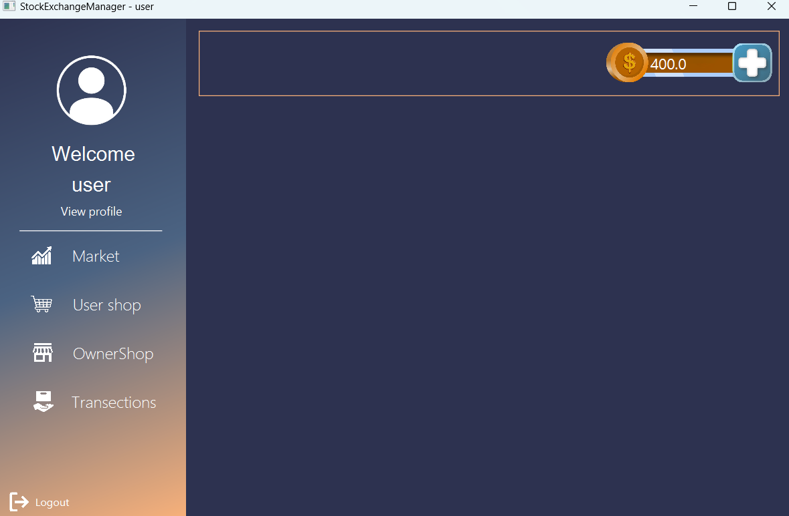
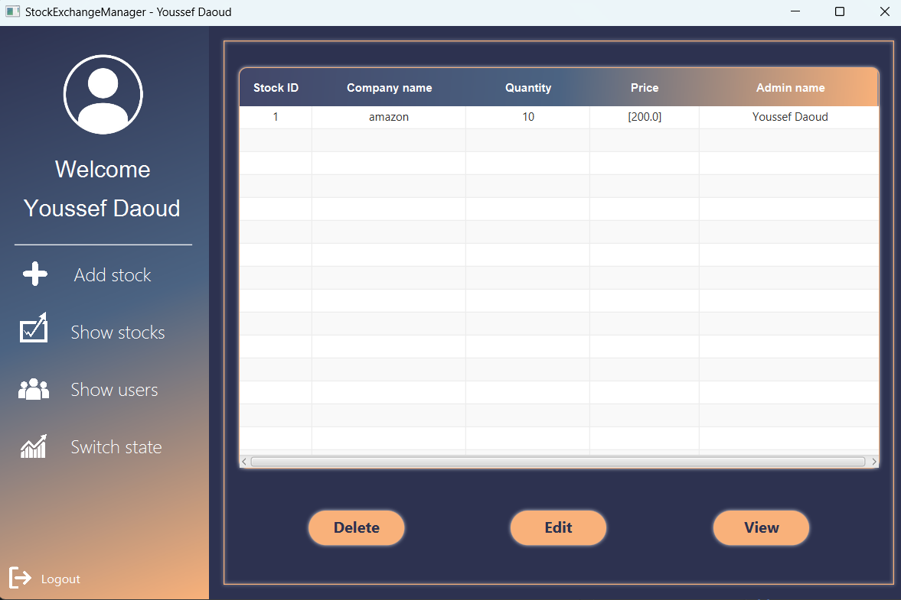
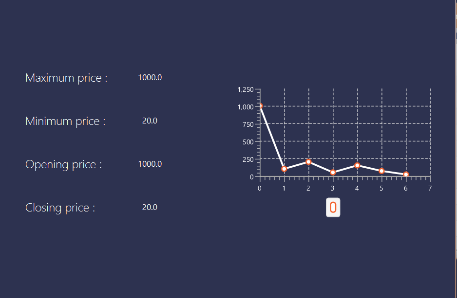

# Stock-Exchange-Manager-OOP-DesignPattern-Java

## Overview

  

Stock Exchange Manager is a comprehensive trading platform that allows users to manage their accounts, place orders, and track stock performance. Admins have the capability to manage users, stocks, and trading sessions, ensuring a seamless and efficient trading experience. The platform supports real-time updates and premium features for enhanced stock monitoring and analysis.

## Table of Contents

1. [Introduction](#introduction)
2. [Technologies Used](#technologies-used)
3. [Workflow](#workflow)
4. [UML](#uml)
5. [Features](#features)
6. [License](#license)

## Introduction
Stock Exchange Manager is a vibrant platform where users dive into the world of stock trading. Imagine this: you're the boss. As an admin, you control the stock market. Add new stocks, start trading sessions, and remove old ones.
Meanwhile, users explore this financial world, buying and selling stocks with ease. It's all about control and opportunity. Every move you make shapes the market. So, jump in, discover, and let the stocks tell their tale. Welcome to Stock Exchange Manager!

## Technologies Used
- **JavaFX**: Utilized for building the graphical user interface (GUI) of the application, providing rich and interactive user experiences.
- **CSS**: Employed for styling the visual components of the JavaFX interface, ensuring a cohesive and aesthetically pleasing design.
- **Java**: The core programming language used for implementing the backend logic and functionality of the application.
- **Object-Oriented Programming (OOP) Design Patterns**: Applied to enhance the structure, modularity, and maintainability of the codebase. 

## Workflow

The Stock Exchange Manager operates through a series of well-defined components and processes:
### User Interaction

1. **Account Management**: Users can create and manage their accounts, ensuring they have access to the trading platform.
2. **Order Placement**: Users can place buy and sell orders for stocks. The system allows for both immediate execution and limit orders, which are executed when the stock price meets the user's criteria.
3. **Funds Management**: Users can deposit and withdraw funds, which are subject to admin approval to ensure security and compliance.

 
 

 ### Admin Operations

1. **User Management**: Admins have full control over user accounts, including the ability to create, update, and delete users.
2. **Stock Management**: Admins manage stock details, including creation, updates, and deletion of stocks. They set properties such as initial price, trading price.
3. **Order Review**: Admins can review and filter stock orders to maintain market integrity.
4. **Trading Sessions**: Admins control trading sessions, initiating and closing sessions to move to the next trading day.

### Real-time Updates and Notifications

- The system provides real-time updates on stock prices and market performance.
- Premium users can subscribe to notifications for specific stock price changes and receive alerts.

## UML

## Features

### Admin Features
1. **Stock Management**
   - Create, update, and delete stocks.
   - Define properties for each stock, including label, company, initial price, trading price, number of available stocks.
2. **Stock Orders**
   - List stock orders filtered by the stock label.
3. **Price History**
   - View the price history of each stock.
5. **Trading Session Control**
   - Initiate and close trading sessions, moving to the next day.

### User Features

1. **Order Management**
- Add, delete, buy, and sell orders for stocks.
2. **Transaction History**
- View past transaction history.
3. **Premium Features**
 - Subscribe for notifications on stock price changes.
4. **Charting Options**
- Display line charts.
- Indicate opening price, closing price, maximum price, minimum price.
5. **Export Functionality**
- Export stock history data to a CSV file.

## License

This project is licensed under the MIT License. See the [LICENSE](LICENSE) file for details.

